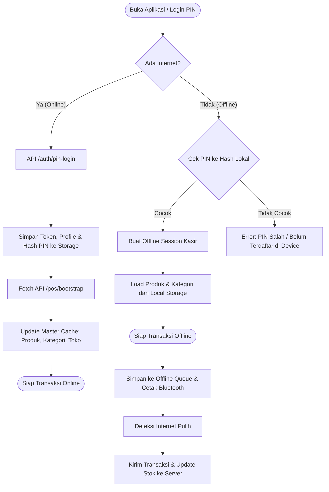

# Rencana Implementasi Arsitektur Offline-First Noli POS

## Ringkasan Masalah & Tujuan
Saat ini aplikasi kasir (`noli_apps`) sudah memiliki penanganan transaksi offline via `OfflineSyncService` (antrean transaksi dan cetak Bluetooth lokal). Namun jika internet/Wi-Fi kafe mati **sebelum** kasir login atau saat pertama kali aplikasi dibuka di pagi hari:
1. Kasir tidak bisa login PIN (gagal request `/auth/pin-login`).
2. Katalog menu, kategori, harga, dan pengaturan toko tidak muncul (gagal request `/pos/bootstrap`).
3. Kasir tidak bisa memulai shift kasir dan modal awal kas.

Tujuan dari implementasi ini adalah membangun sistem **Offline-First yang tangguh (robust & best-practice)** tanpa merusak atau mengubah logika online yang sudah berjalan normal saat ini.

---

## User Review Required

> [!IMPORTANT]
> **Kebijakan Keamanan Offline PIN Login:**
> - PIN kasir akan di-hash (SHA-256) dan disimpan di penyimpanan lokal perangkat saat kasir berhasil login online pertama kali.
> - Saat offline, verifikasi PIN dicocokkan dengan hash lokal. Kasir yang pernah login di perangkat tersebut dapat langsung masuk ke aplikasi dalam mode offline.
> - Token offline sementara (`offline_session_...`) akan diterbitkan di lokal agar alur navigasi POS dan controller tidak mengalami null error.

> [!NOTE]
> **Metode Pembayaran saat Offline:**
> - Saat offline, sistem mengizinkan **Cash (Tunai)** dan **QRIS Statis/EDC Manual**.
> - Header struk dan nama kasir pada cetakan offline akan otomatis mengambil nama toko dan kasir asli dari cache lokal (bukan hardcoded).

---

## Arsitektur & Alur Kerja

---

## Proposed Changes

### 1. Core & Dependencies

#### [MODIFY] [pubspec.yaml](file:///d:/Antigravity/noli_apps/pubspec.yaml)
- Menambahkan dependensi `crypto: ^3.0.6` untuk hashing SHA-256 pada Offline PIN Auth.

---

### 2. Data & Storage Layer

#### [MODIFY] [storage_service.dart](file:///d:/Antigravity/noli_apps/lib/app/data/services/storage_service.dart)
- Menambahkan penyimpanan & getter untuk **Master Data Bootstrap Cache**:
  - `saveBootstrapCache(Map<String, dynamic> data)`
  - `getBootstrapCache()`
  - `bool get hasBootstrapCache`
- Menambahkan penyimpanan & getter untuk **Cashier PIN Hashes & Cached Cashiers**:
  - `saveCashierPinHash(int userId, String pin)`
  - `verifyOfflinePin(String pin, int? selectedUserId)`
  - `saveCachedCashiers(List<UserModel> cashiers)`
  - `getCachedCashiers()`
- Menambahkan penyimpanan **Offline Shift** log.

---

### 3. Authentication Module

#### [MODIFY] [auth_controller.dart](file:///d:/Antigravity/noli_apps/lib/app/modules/auth/controllers/auth_controller.dart)
- **`fetchCashiers()`**: Jika request API berhasil -> simpan cache kasir. Jika gagal (offline) -> load daftar kasir dari cache lokal `_storageService.getCachedCashiers()`.
- **`loginWithPin()`**:
  1. Coba request API `/auth/pin-login`.
  2. Jika sukses -> simpan token, user data, active shift, dan hash PIN kasir ke local storage.
  3. Jika gagal karena kendala jaringan (timeout / connection error):
     - Lakukan verifikasi PIN terhadap hash lokal.
     - Jika lolos -> set sesi offline, navigasikan ke POS, dan tampilkan notifikasi *"Masuk dalam Mode Offline"*.
     - Jika tidak cocok -> tampilkan pesan *"PIN tidak valid atau belum pernah login online di perangkat ini"*.

#### [MODIFY] [pin_login_view.dart](file:///d:/Antigravity/noli_apps/lib/app/modules/auth/views/pin_login_view.dart)
- Menambahkan indikator status jaringan/offline badge halus di header login jika sedang tidak ada koneksi server.

---

### 4. POS & Catalog Module

#### [MODIFY] [pos_controller.dart](file:///d:/Antigravity/noli_apps/lib/app/modules/pos/controllers/pos_controller.dart)
- **`fetchBootstrap()`**:
  1. Langsung memuat data produk, kategori, presets, dan cafe settings dari `_storageService.getBootstrapCache()` jika memori masih kosong (sehingga menu langsung tampil instan tanpa jeda).
  2. Melakukan request API `/pos/bootstrap` di background.
  3. Jika API berhasil -> update state dengan data terbaru & perbarui cache storage.
  4. Jika API gagal karena offline -> tetap gunakan data cache lokal tanpa menampilkan error popup yang mengganggu kasir.

#### [MODIFY] [cart_controller.dart](file:///d:/Antigravity/noli_apps/lib/app/modules/pos/controllers/cart_controller.dart)
- Perbaikan data struk offline:
  - Header struk offline mengambil nama kafe dan alamat asli dari `posController.cafeSettings`.
  - Nama kasir pada struk offline mengambil nama kasir asli dari `_storageService.user?.name`.
- Validasi payment method saat offline (peringatan jika mencoba menggunakan QRIS dinamis API).

---

### 5. Shift Management Module

#### [MODIFY] [shift_controller.dart](file:///d:/Antigravity/noli_apps/lib/app/modules/shift/controllers/shift_controller.dart)
- **`startShift()`**: Jika API gagal koneksi, buat record shift lokal (`is_offline: true`) dengan modal awal yang diinput, sehingga kasir tetap bisa mengoperasikan laci kasir saat offline.
- **`endShift()`**: Jika API gagal koneksi, simpan penutupan shift lokal untuk disinkronkan nanti bersama transaksi offline.

---

### 6. Offline Sync Service

#### [MODIFY] [offline_sync_service.dart](file:///d:/Antigravity/noli_apps/lib/app/data/services/offline_sync_service.dart)
- Menambahkan sanitasi & validasi data transaksi offline saat diunggah ke backend.
- Menambahkan callback untuk auto-refresh data bootstrap setelah sinkronisasi selesai agar stok di aplikasi kasir kembali sinkron dengan backend.

---

## Verification Plan

### Automated Tests
1. Run `flutter pub get` untuk memastikan dependensi terpasang.
2. Run `dart analyze` atau static analysis untuk memastikan tidak ada kesalahan tipe, lint error, atau broken imports.

### Manual Verification Flows
1. **Skenario 1: Buka App Normal (Online)**
   - Login dengan PIN kasir -> pastikan login sukses, data kasir & bootstrap tersimpan ke cache.
2. **Skenario 2: Buka App Saat Wi-Fi / Server Mati (Fresh Start Offline)**
   - Putus koneksi / ganti Base URL ke URL dummy yang tidak aktif.
   - Buka aplikasi -> Masukkan 6 digit PIN kasir yang sudah terdaftar.
   - Pastikan kasir berhasil login ke POS dengan status Offline Session.
   - Pastikan seluruh menu, foto, kategori, dan harga produk muncul lengkap dari cache lokal.
3. **Skenario 3: Transaksi Offline & Cetak Struk**
   - Tambah pesanan ke keranjang -> Pilih Bayar Tunai (Cash).
   - Pastikan transaksi berhasil disimpan ke antrean offline, struk tercetak dengan nama kafe dan nama kasir yang benar.
4. **Skenario 4: Re-koneksi & Sinkronisasi**
   - Hubungkan kembali ke server -> Tekan tombol Sinkronkan Transaksi Offline.
   - Pastikan transaksi terunggah ke backend Laravel dan antrean offline terhapus bersih.
